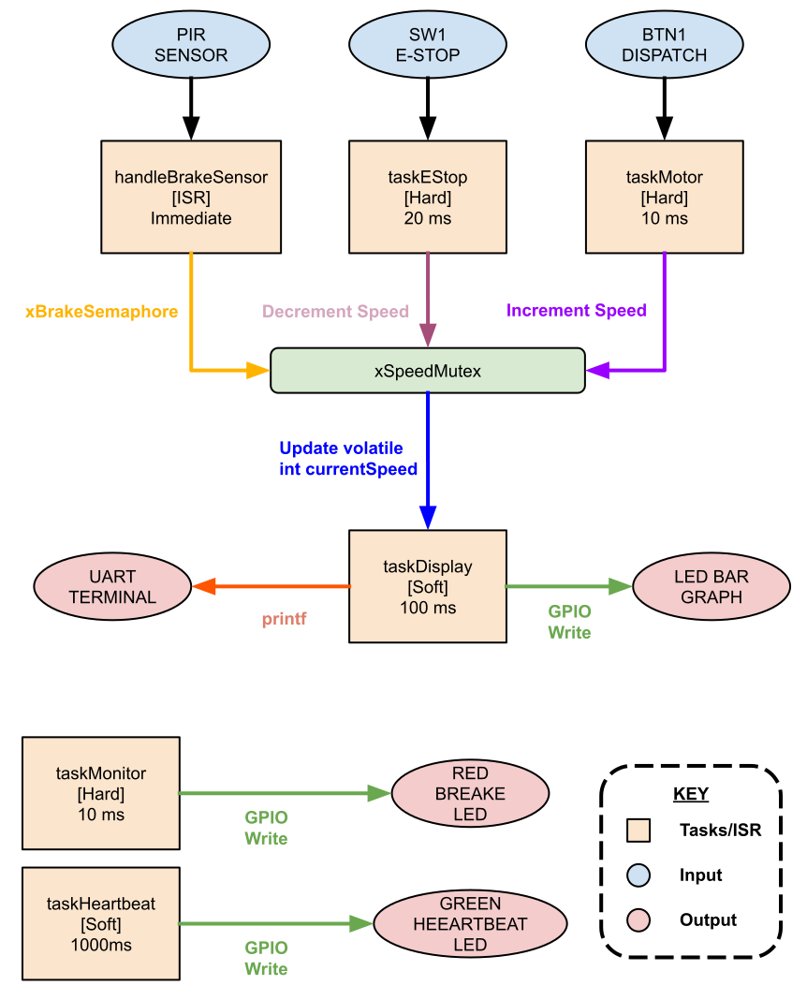

<!-- SHOWCASE: true -->

# Epic Universe Ride Braking System: Application 6

> A FreeRTOS-based proof-of-concept ride control system for a theme park vehicle, simulating dispatch, braking, and emergency stop logic on an ESP32 with hard real-time guarantees.


---

## Course Information

| Field                  | Details                                                                                                                                                                                                                                                                                                                                                                                                                                                                   |
| ---------------------- | ------------------------------------------------------------------------------------------------------------------------------------------------------------------------------------------------------------------------------------------------------------------------------------------------------------------------------------------------------------------------------------------------------------------------------------------------------------------------- |
| Course Title           | Real-Time Systems                                                                                                                                                                                                                                                                                                                                                                                                                                                         |
| Course Number          | EEL 5862                                                                                                                                                                                                                                                                                                                                                                                                                                                                  |
| Semester               | Spring 2026                                                                                                                                                                                                                                                                                                                                                                                                                                                               |
| Assignment Title       | Application 6                                                                                                                                                                                                                                                                                                                                                                                                                                                             |
| Assignment Description | Design and implement a FreeRTOS proof-of-concept in Wokwi for a Central Florida tech company that demonstrates hard and soft real-time tasks, ISR-driven synchronization, shared-resource race protection, and deterministic deadline compliance. The prototype must include an ESP32, at least 4 tasks, at least 1 ISR, 2 distinct synchronization mechanisms, inter-task and external communication channels, and timestamped evidence that all hard deadlines are met. |

---

## Project Description

This project simulates the ride control firmware for a theme park vehicle at Universal Creative's Epic Universe. The system models three operational phases: dispatch (speed ramp-up on cast member input), braking (ISR-triggered speed ramp-down when a vehicle crosses a sensor zone), and emergency stop (highest-priority preemptive ramp-to-zero). A 10-segment LED bar graph provides a live speed visualization, a red LED signals active braking, and a heartbeat LED confirms system liveness. All safety-critical paths are protected by a mutex and a binary semaphore, and serial timestamps demonstrate that every hard deadline is met within margin.

---

## Screenshots / Demo



> _Concurrency diagram showing task priorities, synchronization primitives, and data flow between the ISR, motor control, E-Stop, display, and heartbeat tasks._


> _Full demo video showing dispatch ramp-up, PIR-triggered brake sequence, and emergency stop activation with serial timestamp output._

---

## Results

When the system boots, the following startup message appears on the serial monitor:

```
Starting Epic Universe Ride Control System...
Current Ride Speed: 1
```

Pressing the dispatch button ramps speed from 1 to 10 in 500 ms steps, reflected live on the bar graph and serial output:

```
Current Ride Speed: 2
Current Ride Speed: 3
...
Current Ride Speed: 10
```

Triggering the PIR brake sensor fires the ISR, activates the red brake LED, and ramps speed back down:

```
Current Ride Speed: 9
Current Ride Speed: 8
...
Current Ride Speed: 1
```

Activating the E-Stop switch produces timestamped decrements proving hard deadline compliance:

```
[T=7567 ms] E-Stop switch detected
[T=7567 ms] !!! EMERGENCY STOP ACTIVATED !!!
[T=7568 ms] Speed decremented to 9
[T=7637 ms] Speed decremented to 8
...
[T=8197 ms] Speed decremented to 0
Emergency Stop Cleared. Ready for dispatch.
```

**What to look for:** The gap between the E-Stop detection timestamp and the first speed decrement should always be under 20 ms (the hard deadline). In the sample above it is 1 ms. If speed decrements appear to stall or the bar graph lags significantly, check that `xSpeedMutex` is being released correctly in `taskMotor` and `taskEStop`.

---

## Key Concepts

`FreeRTOS` `Preemptive Scheduling` `ISR` `Binary Semaphore` `Mutex` `Hard Real-Time` `Soft Real-Time` `GPIO` `ESP-IDF` `Race Condition Protection` `Embedded C` `Wokwi Simulation`

---

## Languages & Tools

- **Language:** C (C99)
- **Framework/SDK:** ESP-IDF with FreeRTOS
- **Hardware:** ESP32 DevKit C V4 (simulated in Wokwi), 10-segment LED bar graph, red LED, green heartbeat LED, momentary push button, slide switch, PIR motion sensor, 220-ohm resistors
- **Build System:** Wokwi (simulation); ESP-IDF CMake for physical deployment

---

## File Structure

```
.
├── Wokwi Code/
│   ├── main.c                          # Application firmware: all tasks, ISR, GPIO init, and synchronization
│   ├── diagram.json                    # Wokwi circuit definition: ESP32 wiring for all I/O components
│   ├── wokwi-project.txt               # Wokwi project metadata and simulation entry point
│   └── readme.md                       # Wokwi-specific project notes (separate from this README)
├── _config.yml                         # Jekyll config for GitHub Pages demo site
├── readme_generation_prompt.txt        # Prompt template used to generate this README
└── docs/
    ├── _Assign__6_Concurrency_Diagram.svg   # Task concurrency and data-flow diagram
    └── _Assign_6_Demo_Video.mp4             # Full system demo recording
```

---

## Installation & Usage

### Prerequisites

- [Wokwi](https://wokwi.com) account (browser-based, no install required)
- Or: ESP-IDF v5.x installed locally for physical hardware deployment

### Setup

```bash
# 1. Clone the repository
git clone https://github.com/yourusername/UCF-RealTimeSystems-RideBrakingSystem-Application6.git
cd UCF-RealTimeSystems-RideBrakingSystem-Application6

# 2. Open in Wokwi (recommended)
# - Go to https://wokwi.com
# - Create a new ESP32 project
# - Replace diagram.json and main.c with the files from this repo
# - Press Play to simulate

# 3. Optional: Build for physical ESP32 with ESP-IDF
idf.py build
idf.py flash monitor
```

### Controls

| Input                                    | Action                                                            |
| ---------------------------------------- | ----------------------------------------------------------------- |
| BTN1 (GPIO 4) - Dispatch button          | Ramps speed from 1 to 10 when pressed while system is ready       |
| SW1 (GPIO 5) - E-Stop slide switch       | Activates emergency stop; ramps speed to 0 and locks out dispatch |
| PIR Sensor (GPIO 18) - Brake zone sensor | Triggers ISR; activates brake LED and ramps speed from 10 to 1    |

---

## Academic Integrity

This repository is publicly available for **portfolio and reference purposes only**.
Please do not submit any part of this work as your own for academic coursework.
